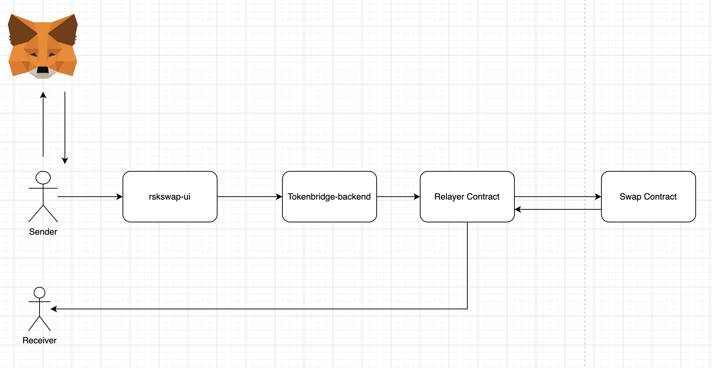

# rskswap-ui
Project for Swaping RBTC to rWBTC independently from the claim (and the other way round too) 

## Architecture Diagram



## Use Cases

### Swap WBTC to rBTC 
This use case allows a user that has crossed WBTC/BTCB from multichain.org onto RSK (rWE to swap those tokens for RBTC, using a relayer that provides with the necessary liquidity an paid with the btc-pegged asset. The flow is described as in the following sequence diagram

## Environment variables
Duplicate .env.example and rename to .env

Following environment variables description below:

```
VUE_APP_CHAIN_ID => Chain/Network id.
VUE_APP_NETWORK_NAME => Chain/Network name.
VUE_APP_LOCALSTORAGE_NAME => Localstorage rootKey to access data in browser storage.
VUE_APP_RELAYER_ADDRESS => Relayer contract address, this address is used to find relayer instance in the network.
VUE_APP_SWAP_ADDRESS => Swap contract contract address, this address is used to find swap instance in the network.
VUE_APP_RELAYER_ENDPOINT => Backend URI address.
VUE_APP_ENV => Application Environment.

```

## Project setup

### Download and Install dependecies
```
yarn install
```

### Compiles and hot-reloads for development
```
yarn serve
```

### Compiles and minifies for production
```
yarn build
```

### Run your unit tests
```
yarn test:unit
```

### Run your end-to-end tests
```
yarn test:e2e
```

### Lints and fixes files
```
yarn lint
```

### Register Bugs and Suggestions

See [Register Bugs](https://github.com/rsksmart/rskswap-ui/issues).


### Customize configuration
See [Configuration Reference](https://cli.vuejs.org/config/).
